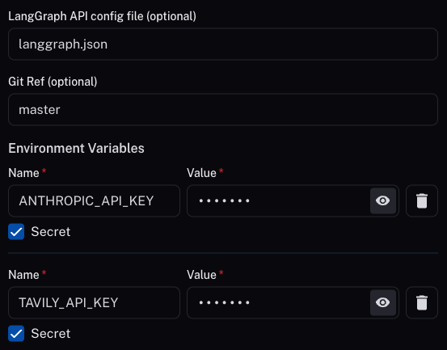
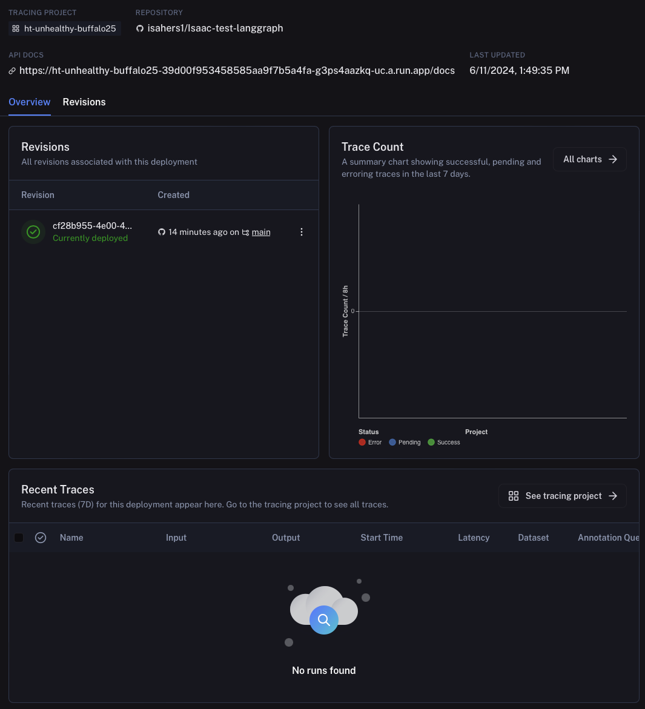
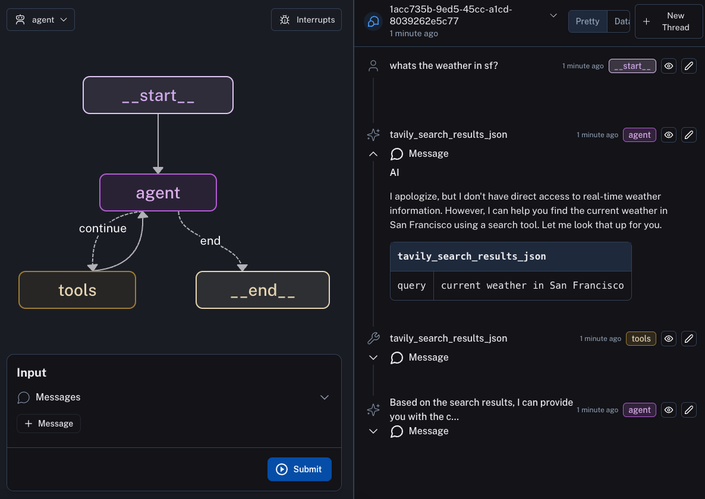

# Quick Start

This quick start guide will cover how to build a simple agent that can look up things on the internet. We will then deploy it to LangGraph Cloud, use the LangGraph Studio to visualize and test it out, and use the LangGraph SDK to interact with it.

## Set up requirements

This tutorial will use:

- Anthropic for the LLM - sign up and get an API key [here](https://console.anthropic.com/)
- Tavily for the search engine - sign up and get an API key [here](https://app.tavily.com/)
- LangSmith for hosting - sign up and get an API key [here](https://smith.langchain.com/)

## Set up local files

1.  Create a new application with the following directory and files:

=== "Python"

        <my-app>/
        |-- agent.py            # code for your LangGraph agent
        |-- requirements.txt    # Python packages required for your graph
        |-- langgraph.json      # configuration file for LangGraph
        |-- .env                # environment files with API keys

=== "Javascript"

        <my-app>/
        |-- agent.ts            # code for your LangGraph agent
        |-- package.json        # Javascript packages required for your graph
        |-- langgraph.json      # configuration file for LangGraph
        |-- .env                # environment files with API keys

2.  The `agent.py`/`agent.ts` file should contain code for defining your graph. The following code is a simple example, the important thing is that at some point in your file you compile your graph and assign the compiled graph to a variable (in this case the `graph` variable). This example code uses `create_react_agent`, a prebuilt agent. You can read more about it [here](../concepts/agentic_concepts.md#react-agent).

=== "Python"

    ```python
    from langchain_anthropic import ChatAnthropic
    from langchain_community.tools.tavily_search import TavilySearchResults
    from langgraph.prebuilt import create_react_agent

    model = ChatAnthropic(model="claude-3-5-sonnet-20240620")

    tools = [TavilySearchResults(max_results=2)]

    graph = create_react_agent(model, tools)
    ```

=== "Javascript"

    ```ts
    import { ChatAnthropic } from "@langchain/anthropic";
    import { TavilySearchResults } from "@langchain/community/tools/tavily_search";
    import { createReactAgent } from "@langchain/langgraph/prebuilt";

    const model = new ChatAnthropic({
      model: "claude-3-5-sonnet-20240620",
    });

    const tools = [
      new TavilySearchResults({ maxResults: 3, }),
    ];

    export const graph = createReactAgent({ llm: model, tools });
    ```

3.  The `requirements.txt`/`package.json` file should contain any dependencies for your graph(s). In this case we only require four packages for our graph to run:

=== "Python"

        ```
        langgraph
        langchain_anthropic
        tavily-python
        langchain_community
        ```

=== "Javascript"

        ```json
        {
          "name": "my-app",
          "packageManager": "yarn@1.22.22",
          "dependencies": {
            "@langchain/community": "^0.2.31",
            "@langchain/core": "^0.2.31",
            "@langchain/langgraph": "0.2.0",
            "@langchain/openai": "^0.2.8"
          }
        }
        ```

4.  The [`langgraph.json`][langgraph.json] file is a configuration file that describes what graph(s) you are going to host. In this case we only have one graph to host: the compiled `graph` object from `agent.py`/`agent.ts`.

=== "Python"

    ```json
    {
      "dependencies": ["."],
      "graphs": {
        "agent": "./agent.py:graph"
      },
      "env": ".env"
    }
    ```

=== "Javascript"

    ```json
    {
      "node_version": "20",
      "dockerfile_lines": [],
      "dependencies": ["."],
      "graphs": {
        "agent": "./src/agent.ts:graph"
      },
      "env": ".env"
    }
    ```

Learn more about the LangGraph CLI configuration file [here](./reference/cli.md#configuration-file).

5.  The `.env` file should have any environment variables needed to run your graph. This will only be used for local testing, so if you are not testing locally you can skip this step. NOTE: if you do add this, you should NOT check this into git. For this graph, we need two environment variables:

    ```shell
    ANTHROPIC_API_KEY=...
    TAVILY_API_KEY=...
    ```

Now that we have set everything up on our local file system, we are ready to host our graph.

## Test the graph build locally

### Using LangGraph Studio Desktop (recommended)


Testing your graph locally is easy with LangGraph Studio Desktop. LangGraph Studio offers a new way to develop LLM applications by providing a specialized agent IDE that enables visualization, interaction, and debugging of complex agentic applications

With visual graphs and the ability to edit state, you can better understand agent workflows and iterate faster. LangGraph Studio integrates with [LangSmith](https://smith.langchain.com) so you can collaborate with teammates to debug failure modes.

### Using the LangGraph CLI

Before deploying to the cloud, we probably want to test the building of our graph locally. This is useful to make sure we have configured our [CLI configuration file][langgraph.json] correctly and our graph runs.

In order to do this we can first install the LangGraph CLI

```shell
pip install langgraph-cli
```

We can then test our API server locally. This requires access to LangGraph closed beta. In order to run the server locally, you will need to add your `LANGSMITH_API_KEY` to the .env file so we can validate you have access to LangGraph closed beta.

```shell
langgraph up
```

This will start up the LangGraph API server locally. If this runs successfully, you should see something like:

```shell
Ready!
- API: http://localhost:8123
2024-06-26 19:20:41,056:INFO:uvicorn.access 127.0.0.1:44138 - "GET /ok HTTP/1.1" 200
```

You can now test this out! **Note: this local server is intended SOLELY for local testing purposes and is not performant enough for production applications, so please do not use it as such.** To test it out, you can go to another terminal window and run:

```shell
curl --request POST \
    --url http://localhost:8123/runs/stream \
    --header 'Content-Type: application/json' \
    --data '{
    "assistant_id": "agent",
    "input": {
        "messages": [
            {
                "role": "user",
                "content": "How are you?"
            }
        ]
    },
    "metadata": {},
    "config": {
        "configurable": {}
    },
    "multitask_strategy": "reject",
    "stream_mode": [
        "values"
    ]
}'
```

If you get back a valid response, then all is functioning properly!

## Deploy to Cloud

### Push your code to GitHub

Turn the `<my-app>` directory into a GitHub repo. You can use the GitHub CLI if you like, or just create a repo manually (if unfamiliar, instructions [here](https://docs.github.com/en/migrations/importing-source-code/using-the-command-line-to-import-source-code/adding-locally-hosted-code-to-github)).

### Deploy from GitHub with LangGraph Cloud

Once you have created your github repository with a Python file containing your compiled graph as well as a `langgraph.json` file containing the configuration for hosting your graph, you can head over to LangSmith and click on the 🚀 icon on the left navbar to create a new deployment. Then click the `+ New Deployment` button.


**_If you have not deployed to LangGraph Cloud before:_** there will be a button that shows up saying Import from GitHub. You’ll need to follow that flow to connect LangGraph Cloud to GitHub.

**_Once you have set up your GitHub connection:_** the new deployment page will look as follows:


To deploy your application, you should do the following:

1. Select your GitHub username or organization from the selector
2. Search for your repo to deploy in the search bar and select it
3. Choose any name
4. In the `LangGraph API config file` field, enter the path to your `langgraph.json` file (which in this case is just `langgraph.json`)
5. For Git Reference, you can select either the git branch for the code you want to deploy, or the exact commit SHA.
6. If your chain relies on environment variables, add those in. They will be propagated to the underlying server so your code can access them. In this case, we need `ANTHROPIC_API_KEY` and `TAVILY_API_KEY`.

Putting this all together, you should have something as follows for your deployment details:



Hit `Submit` and your application will start deploying!

## Inspect Traces + Monitor Service

### Deployments View

After your deployment is complete, your deployments page should look as follows:



You can see that by default, you get access to the `Trace Count` monitoring chart and `Recent Traces` run view. These are powered by LangSmith.

You can click on `All Charts` to view all monitoring info for your server, or click on `See tracing project` to get more information on an individual trace.

### Access the Docs

You can access the docs by clicking on the API docs link, which should send you to a page that looks like this:


You won’t actually be able to test any of the API endpoints without authorizing first. To do so, grab your Langsmith API key and add it at the top where it says `API KEY (X-API-KEY)`. You should now be able to select any of the API endpoints, click `Test Request`, enter the parameters you would like to pass, and then click `Send` to view the results of the API call.

## Interact with your deployment via LangGraph Studio

If you click on your deployment you should see a blue button in the top right that says `LangGraph Studio`. Clicking on this button will take you to a page that looks like this:


On this page you can test out your graph by passing in starting states and clicking `Start Run` (this should behave identically to calling `.invoke`). You will then be able to look into the execution thread for each run and explore the steps your graph is taking to produce its output.



## Use with the SDK

Once you have tested that your hosted graph works as expected using LangGraph Studio, you can start using your hosted graph all over your organization by using the LangGraph SDK. Let's see how we can access our hosted graph and execute our run from a python file.

First, make sure you have the SDK installed by calling `pip install langgraph_sdk`.

Before using, you need to get the URL of your LangGraph deployment. You can find this in the `Deployment` view. Click the URL to copy it to the clipboard.

You also need to make sure you have set up your API key properly so you can authenticate with LangGraph Cloud.

```shell
export LANGSMITH_API_KEY=...
```

The first thing to do when using the SDK is to setup our client, access our assistant, and create a thread to execute a run on:

```python
from langgraph_sdk import get_client

# Replace this with the URL of your own deployed graph
URL = "https://chatbot-23a570f3210f52a7b167f09f6158e3b3-ffoprvkqsa-uc.a.run.app"
client = get_client(url=URL)

# Search all hosted graphs
assistants = await client.assistants.search()
# In this example we select the first assistant since we are only hosting a single graph
assistant = assistants[0]

# We create a thread for tracking the state of our run
thread = await client.threads.create()
```

We can then execute a run on the thread:

```python
input = {"messages":[{"role": "user", "content": "Hello! My name is Bagatur and I am 26 years old."}]}

async for chunk in client.runs.stream(
        thread['thread_id'],
        assistant["assistant_id"],
        input=input,
        stream_mode="updates",
    ):
    if chunk.data and chunk.event != "metadata":
        print(chunk.data)
```

    {'agent': {'messages': [{'content': "Hi Bagatur! It's nice to meet you. How can I assist you today?", 'additional_kwargs': {}, 'response_metadata': {'finish_reason': 'stop', 'model_name': 'gpt-4o-2024-05-13', 'system_fingerprint': 'fp_9cb5d38cf7'}, 'type': 'ai', 'name': None, 'id': 'run-c89118b7-1b1e-42b9-a85d-c43fe99881cd', 'example': False, 'tool_calls': [], 'invalid_tool_calls': [], 'usage_metadata': None}]}}

## What's Next

Congratulations! If you've worked your way through this tutorial you are well on your way to becoming a LangGraph Cloud expert. Here are some other resources to check out to help you out on the path to expertise:

### LangGraph Cloud How-tos

If you want to learn more about streaming from hosted graphs, check out the Streaming [how-to guides](how-tos/index.md#streaming).

To learn more about double-texting and all the ways you can handle it in your application, read up on these [how-to guides](how-tos/index.md#double-texting).

To learn about how to include different human-in-the-loop behavior in your graph, take a look at [these how-tos](how-tos/index.md#human-in-the-loop).

### LangGraph Tutorials

Before hosting, you have to write a graph to host. Here are some tutorials to get you more comfortable with writing LangGraph graphs and give you inspiration for the types of graphs you want to host.

[This tutorial](../tutorials/customer-support/customer-support.ipynb) walks you through how to write a customer support bot using LangGraph.

If you are interested in writing a SQL agent, check out [this tutorial](../tutorials/sql-agent.ipynb).

Check out the [LangGraph tutorials](../tutorials/index.md) page to read about more exciting use cases.
