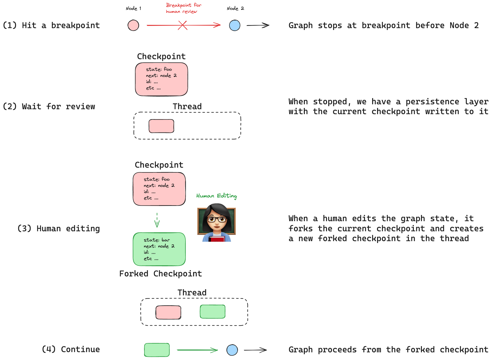

# Human-in-the-loop

Agents often benefit from human-in-the-loop (or "on-the-loop") interaction patterns. There are a few motivations for this:

(1) `Approval` - We can interrupt our agent, surface the current state to a user, and allow the user to accept an action. 

(2) `Editing` - We can interrupt our agent, surface the current state to a user, and allow the user to edit the agent state. 

(3) `Feedback` - We can explicitly create a graph node to collect human feedback and pass that feedback to the agent state.

(4) `Debugging` - We can manually re-play and / or fork past actions of an agent.

## Foundations

All of these interaction patterns are enabled by LangGraph's built-in [persistence](./persistence.md) layer, which will write a checkpoint of the graph state at each step. 

This allows us to stop the graph at a specific step (with a [breakpoint](./low_level.md#breakpoints)). 

Once the graph is stopped, the above human-in-the-loop interaction patterns can be implemented as shown below!

## Approval


 Sometimes we want to approve certain steps in our agent's execution. 
 
 We can interrupt our agent at a [breakpoint](./low_level.md#breakpoints) prior to the step that we want to approve.

 This is generally recommend for sensitive actions (e.g., using external APIs or writing to a database).
 
 With persistence, we can surface the current agent state as well as the next step to a user for review and approval. 
 
 If approved, we can resume execution of the graph from the last saved checkpoint, which is saved to the `thread`, easily:

```python
# If approved, continue the graph execution from the last saved checkpoint
for event in graph.stream(None, thread, stream_mode="values"):
    print(event)
```

See [our guide](../how-tos/human_in_the_loop/breakpoints.ipynb) for a detailed how-to on doing this!

## Editing



 Sometimes we want to review and edit the agent's state. 
 
 We can interrupt our agent at a [breakpoint](./low_level.md#breakpoints) prior the the step we want to check. 
 
 We can surface the current state to a user, and allow the user to edit the agent state.
 
This can, for example, be used to correct the agent if it made a mistake (e.g., see the discussion on tool calling below).

 We can edit the graph state by forking the current checkpoint, which is saved to the `thread`:

```python
graph.update_state(thread, {"state": "new state"})
```

We can then proceed with the graph from our forked checkpoint as done before: 

```python
# Continue the graph execution from the forked checkpoint 
for event in graph.stream(None, thread, stream_mode="values"):
    print(event)
```
See [this guide](../how-tos/human_in_the_loop/edit-graph-state.ipynb) for a detailed how-to on doing this!

### Review Tool Calls

Many agents use [tool calling](https://python.langchain.com/docs/how_to/tool_calling/) to make decisions. Tool calling present a challenge because the agent must get two things right: (1) The name of the tool to call and (2) the arguments to pass to the tool. Because of this, it is sometimes useful to have a human review the tool call to ensure that the agent is calling the correct tool with the correct arguments. When reviewing tool calls, there are few actions to consider, including approval (as noted above), but also manually changing the tool call (tool name or the tool arguments) or leaving feedback on the tool call. The latter can involve leaving natural language feedback suggesting the LLM call it differently (or call a different tool).

See [this guide](../how-tos/human_in_the_loop/review-tool-calls.ipynb) for a detailed how-to on doing this!

## Feedback


 Sometimes we want to explicitly collect human feedback at a particular step in the graph. 
 
 We can simply create a graph node to collect human feedback and interrupt our agent at a [breakpoint](./low_level.md#breakpoints) prior to this node.
 
The state update with the user feedback is very similar to editing state, using `as_node=...` to specify that the state update should be treated as a node.

```python
# Update the state with the user feedback as if it was the human_feedback node
graph.update_state(thread, {"user_feedback": user_input}, as_node="human_feedback")
```
One this is done, the graph can then proceed to the steps that follow the `human_feedback` node as done before: 

```python
# Continue the graph execution after the human_feedback node
for event in graph.stream(None, thread, stream_mode="values"):
    print(event)
```

See [this guide](../how-tos/human_in_the_loop/wait-user-input.ipynb) for a detailed how-to on doing this!

## Debugging

It's possible both to manually re-play and / or fork past actions of an agent. We cover these concepts [here](https://langchain-ai.github.io/langgraph/concepts/persistence/#replay) and [here](https://langchain-ai.github.io/langgraph/concepts/persistence/#update-state), but they are worth calling out specifically for their relevance to human-in-the-loop debugging.

In addition to the conceptual docs, see [this guide](../how-tos/human_in_the_loop/time-travel.ipynb) for a detailed how-to on doing this!

