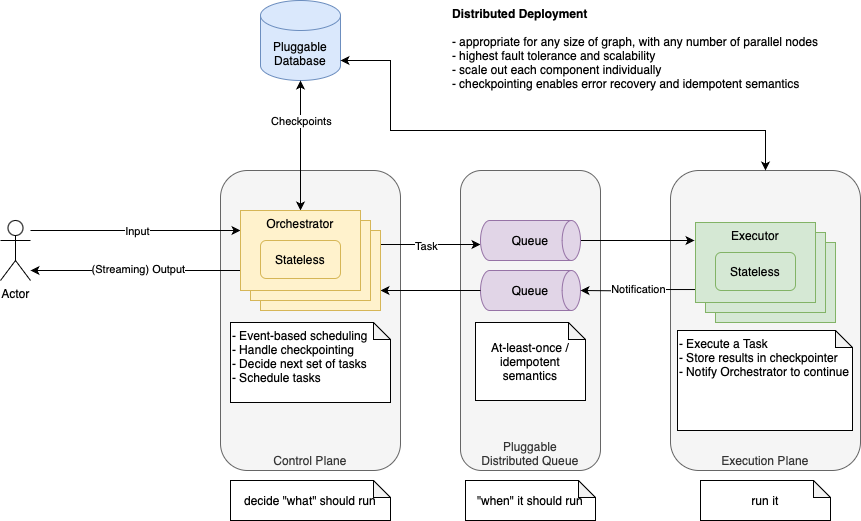

# LangGraph Scheduler for Kafka

This library implements a distributed scheduler for LangGraph using Kafka as the message broker.

## Architecture



- Combination of Kafka (at least once) with a LangGraph Checkpointer provides exactly once semantics both for orchestrator and executor messages
- Checkpointer ensures writes for a given task are saved only once, even if the task is re-executed
- Checkpointer is used to record whether each task in each step has been successfully published to Kafka, to ensure tasks aren't lost, or published more than once
- Orchestrator and Executor manage commit of offsets manually to ensure tasks are marked as done only after finished processing
- Orchestrator and Executor pick up from the earliest message not yet consumed when restarted, to ensure no message is lost, and avoid processing messages more than once
- Orchestrator messages are keyed by thread ID and checkpoint NS, to ensure that no two consumers can process updates for same step of same thread concurrently
- Executor messages are not keyed, as they can be processed concurrently
- Orchestrator and Executor execute messages in configurable batches (up to N messages within space of X seconds), and dedupe messages intra-batch where appropriate (this is purely a performance optimization, with no impact on correctness whether applied or not)

## Basic Usage

Launch orchestrator and executor processes:

`orchestrator.py`

```python
import asyncio
import logging
import os

from langgraph.scheduler.kafka.orchestrator import KafkaOrchestrator
from langgraph.scheduler.kafka.types import Topics

from your_lib import graph # graph expected to be a compiled LangGraph graph

logger = logging.getLogger(__name__)

topics = Topics(
    orchestrator: os.environ['KAFKA_TOPIC_ORCHESTRATOR'],
    executor: os.environ['KAFKA_TOPIC_EXECUTOR'],
    error: os.environ['KAFKA_TOPIC_ERROR'],
)

async def main():
    async with KafkaOrchestrator(graph, topics) as orch:
        async for msgs in orch:
            logger.info('Procesed %d messages', len(msgs))

if __name__ == '__main__':
    logging.basicConfig(level=logging.INFO)
    asyncio.run(main())
```

`executor.py`

```python
import asyncio
import logging
import os

from langgraph.scheduler.kafka.executor import KafkaExecutor
from langgraph.scheduler.kafka.types import Topics

from your_lib import graph # graph expected to be a compiled LangGraph graph

logger = logging.getLogger(__name__)

topics = Topics(
    orchestrator: os.environ['KAFKA_TOPIC_ORCHESTRATOR'],
    executor: os.environ['KAFKA_TOPIC_EXECUTOR'],
    error: os.environ['KAFKA_TOPIC_ERROR'],
)

async def main():
    async with KafkaExecutor(graph, topics) as orch:
        async for msgs in orch:
            logger.info('Procesed %d messages', len(msgs))

if __name__ == '__main__':
    logging.basicConfig(level=logging.INFO)
    asyncio.run(main())
```

```bash
export KAFKA_TOPIC_ORCHESTRATOR='orchestrator'
export KAFKA_TOPIC_EXECUTOR='executor'
export KAFKA_TOPIC_ERROR='error'
python orchestrator.py &
python executor.py &
```

## Configuration

You can pass any of the following values as `kwargs` to either `KafkaOrchestrator` or `KafkaExecutor` to configure the consumer:

- group_id (str): a name for the consumer group. Defaults to 'orchestrator' or 'executor', respectively.
- batch_max_n (int): Maximum number of messages to include in a single batch. Default: 10.
- batch_max_ms (int): Maximum time in milliseconds to wait for messages to include in a batch. Default: 1000.
- retry_policy (langgraph.pregel.types.RetryPolicy): Controls which graph-level errors will be retried when processing messages. A good use for this is to retry database errors thrown by the checkpointer. Defaults to None.

### Connection settings

By default the orchestrator and executor will attempt to connect to a Kafka broker running on `localhost:9092`. You can change connection settings by passing any of the following values as `kwargs` to either `KafkaOrchestrator` or `KafkaExecutor`:

- bootstrap_servers: 'host[:port]' string (or list of 'host[:port]'
  strings) that the consumer should contact to bootstrap initial
  cluster metadata. This does not have to be the full node list.
  It just needs to have at least one broker that will respond to
  Metadata API Request. Default port is 9092. If no servers are
  specified, will default to localhost:9092.
- client_id (str): a name for this client. This string is passed in
  each request to servers and can be used to identify specific
  server-side log entries that correspond to this client. Also
  submitted to GroupCoordinator for logging with respect to
  consumer group administration. Default: 'aiokafka-{ver}'
- request_timeout_ms (int): Client request timeout in milliseconds.
  Default: 40000.
- metadata_max_age_ms (int): The period of time in milliseconds after
  which we force a refresh of metadata even if we haven't seen
  any partition leadership changes to proactively discover any
  new brokers or partitions. Default: 300000
- retry_backoff_ms (int): Milliseconds to backoff when retrying on
  errors. Default: 100.
- api_version (str): specify which kafka API version to use.
  AIOKafka supports Kafka API versions >=0.9 only.
  If set to 'auto', will attempt to infer the broker version by
  probing various APIs. Default: auto
- security_protocol (str): Protocol used to communicate with brokers.
  Valid values are: PLAINTEXT, SSL, SASL_PLAINTEXT, SASL_SSL.
  Default: PLAINTEXT.
- ssl_context (ssl.SSLContext): pre-configured SSLContext for wrapping
  socket connections. For more information see :ref:`ssl_auth`.
  Default: None.
- connections_max_idle_ms (int): Close idle connections after the number
  of milliseconds specified by this config. Specifying `None` will
  disable idle checks. Default: 540000 (9 minutes).
